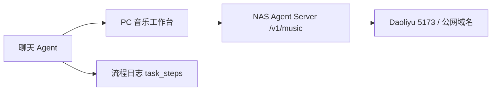

# Step 140: Music Operable Workspace Plan

## Goal

把音乐模块从“只能看 Daoliyu 状态”推进到“可以真实操作”。第一版优先保证功能可用：能搜索、能播放控制、能看歌曲详情、能创建歌单、能把聊天里的 `@音乐` 命令转成可见流程日志和真实音乐动作。

## Scope

本阶段实现 PC 端音乐工作台和聊天 Agent 的第一批可操作闭环：

1. 音乐工作台搜索歌曲。
2. 音乐工作台查看歌曲详情。
3. 音乐工作台播放、暂停、上一首、下一首。
4. 音乐工作台创建歌单。
5. 音乐工作台把选中歌曲加入指定歌单。
6. 聊天输入支持第一批 `@音乐` 命令。
7. 所有音乐动作写入流程日志。

不在本阶段实现复杂播放器皮肤、歌词滚动、音频波形、批量歌单管理、真实推荐算法和移动端同步。

## Architecture

PC 前端不直接连接 Daoliyu，也不保存 Daoliyu token。所有音乐能力统一走 NAS Agent Server：

前端新增一组 music helper：

- `searchMusicTracks`
- `getMusicTrackDetail`
- `playMusicTrack`
- `pauseMusic`
- `playNextMusic`
- `playPreviousMusic`
- `createMusicPlaylist`
- `addTrackToMusicPlaylist`

NAS 服务端继续使用现有 `/v1/music/{full_path:path}` 代理能力，不在 PC 端暴露登录凭据。

## UI Design

音乐工作台第一版分为四块：

1. 顶部状态区：Daoliyu 登录、当前上游、播放器状态、用户。
2. 控制区：刷新、服务端登录、播放、暂停、上一首、下一首。
3. 搜索和列表区：搜索框、歌曲列表、歌单列表。
4. 详情区：选中歌曲详情、原始字段、播放、加入歌单。

创建歌单使用轻量表单：歌单名称、可见性/描述如果接口支持就传递，不支持则只传名称。

## Chat Commands

第一批支持这些聊天命令：

- `@音乐 播放 <关键词>`：搜索歌曲，选择第一条结果并播放。
- `@音乐 暂停`：暂停当前播放。
- `@音乐 下一首`：切到下一首。
- `@音乐 上一首`：切到上一首。
- `@音乐 创建歌单 <名称>`：创建歌单。
- `@音乐 搜索 <关键词>`：只搜索并展示结果，不自动播放。

如果命令不明确，Agent 不直接猜测执行高风险动作，而是写入“需要确认/需要补充”的流程日志，并在聊天里提示可用格式。

## Task Log

每次音乐动作创建或复用一个 task session，并追加步骤：

1. `music_intent_detected`
2. `music_search_tracks`
3. `music_select_track`
4. `music_execute_action`
5. `music_refresh_state`

失败时记录 `status = error` 和错误摘要；成功时记录 Daoliyu 返回摘要，不记录 token、密码、cookies。

## Error Handling

- Daoliyu 未登录：显示“服务端未登录”，提供“服务端登录”按钮。
- Daoliyu 不可达：显示当前上游和失败原因。
- 搜索无结果：显示空状态，不自动播放。
- 创建歌单失败：保留用户输入，显示错误。
- 添加歌曲到歌单失败：显示歌曲和歌单 ID，方便排查接口字段。

## Implementation Plan

1. 后端能力确认：用 curl 验证 Daoliyu 搜索、播放、歌单创建、加入歌单接口的真实请求体。
2. 前端 backend helper：封装音乐搜索、详情、播放控制、歌单操作。
3. 音乐工作台 UI：加搜索、列表、详情、播放控制和创建歌单表单。
4. 聊天命令：解析 `@音乐` 命令并调用对应 helper。
5. 流程日志：每个聊天音乐动作写入 task steps。
6. 验证：`pnpm build`、`cargo test`、Python compile、curl 抽检 NAS 音乐接口。
7. 提交推送：检查 diff 不包含真实账号密码和 token 后提交。

## Acceptance Criteria

- 音乐模块可以搜索歌曲并显示结果。
- 点击歌曲可以打开详情。
- 播放、暂停、上一首、下一首按钮能发出真实请求。
- 可以从 PC 端创建歌单。
- 可以把选中的歌曲加入歌单。
- 输入 `@音乐 播放 测试关键词` 会生成流程日志，并尝试真实播放。
- 构建和测试通过。
- 提交内容不包含任何真实密钥。
