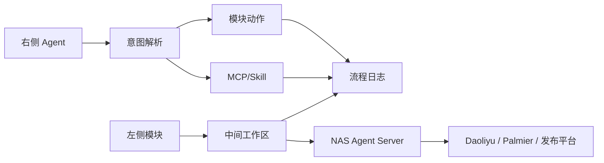

# Product Design Workbench Redesign

## Goal

把 Personal OS Agent 从“功能堆在一个页面里”重设计成一个长期可用的个人工作系统。核心目标不是做展示页，而是让小说、漫画/表情包、视频画布、音乐、博客、记忆、知识库、MCP/Skill 和 NAS 能在同一个工作台里稳定工作，并且都能被右侧 Agent 对话调度。

## Chosen Direction

采用方案 B：工作台式产品系统。

页面不做 landing page，不做大面积装饰。整体像桌面生产力工具：左侧模块导航，中间当前模块工作区，右侧 Agent，对底部流程日志做独立滚动和可折叠控制。

## Product Principles

1. 左侧只放真实功能模块，不放设置、AI 配置、NAS 这类系统入口。
2. 每个模块打开后必须是可操作工作区，不出现“看起来像按钮但没有功能”的假入口。
3. Agent 对话不是替代工作区，而是调度工作区；聊天执行的每一步都要能在流程日志看到。
4. 流程日志默认低高度，但必须可滚动、可放大、可收起。
5. 设置、AI 配置、MCP/Skill、NAS 连接放到右上系统入口或独立系统抽屉。
6. 页面要适合长期使用：信息密度高、状态清楚、动作直接、视觉克制。

## Information Architecture

### Left Navigation

左侧只保留真实功能模块：

- 小说
- 漫画/表情包
- 视频画布
- 音乐
- 博客
- 记忆
- 知识库
- 资产/软件库

每个模块显示：图标、名称、短状态点。状态点只表达模块连接/准备状态，不写长说明。

### Top Bar

顶部负责当前上下文和系统入口：

- 当前模块标题
- 当前模块一句状态
- NAS 连接状态
- Agent 模型状态
- 系统入口：设置、AI 配置、MCP/Skill、发布渠道

顶部不放大量按钮，避免抢占工作区空间。

### Center Workbench

中间是当前模块的真实工作区。不同模块可以有不同布局，但必须遵守同一结构：

- 工具栏：搜索、刷新、新建、主要动作
- 主列表或画布：模块主要数据
- 详情面板：选中对象的详情和操作
- 状态提示：错误、连接、等待确认

### Right Agent

右侧是 Agent 对话和上下文面板：

- 聊天消息
- 当前模型
- 当前命令解析结果
- 与当前模块相关的快捷命令
- 可显示“这次会调用哪些模块/MCP/Skill”

右侧可以收起；收起后中间工作区自动变大。

### Bottom Process Log

底部流程日志固定在页面底部：

- 默认低高度
- 图标按钮控制：收起、半高、放大
- 内部左右两栏独立滚动
- 左侧任务列表，右侧当前任务步骤
- 支持过滤、搜索、待确认任务高亮

流程日志绝不能撑破页面。

## Visual Direction

整体视觉：安静、专业、工作导向。

- 背景：浅灰工作区，白色内容面板
- 文字：深灰/黑，保持清晰层级
- 状态色：绿色成功、琥珀警告、红色错误、蓝色进行中
- 圆角：控制在 6-8px
- 卡片：只用于独立对象、面板和详情，不做层层套卡
- 字号：工具界面保持紧凑，避免 hero 级大字
- 图标：继续使用 lucide 图标，按钮优先图标+简短文字

## Module Patterns

### 音乐模块

第一屏需要看到：

- Daoliyu 登录状态
- 当前播放状态
- 搜索歌曲
- 歌曲列表
- 歌曲详情
- 歌词
- 歌单操作

播放按钮必须明确语义：

- 当前阶段是“发送播放指令到 Daoliyu”
- 等稳定音频流接口确认后，再升级为 PC 应用内真实播放

### 博客模块

博客模块以发布工作流为中心：

- 草稿列表
- 草稿编辑/预览
- 发布渠道状态
- 发布清单
- 本地发布记录

真实发布外部平台前必须保留确认门。

### 视频画布模块

视频模块以画布/时间线为中心：

- Palmier MCP 状态
- 画布资源
- 时间线/剪辑任务
- 生成任务
- 导出记录

第一版只显示连接和任务，不自动执行剪辑删除或付费生成。

### 记忆模块

记忆模块要突出“最懂我的 Agent”：

- 已启用长期记忆
- 待确认记忆候选
- 来源聊天
- 记忆类型过滤
- 启用/禁用/删除

任何长期记忆都要能看到来源和信心。

### MCP/Skill

MCP 和 Skill 不放左侧功能模块，放系统入口：

- MCP 列表
- Skill 列表
- 新增配置
- 启用/禁用
- 风险等级
- 调用确认策略

Agent 调用时流程日志里显示具体用了哪个 MCP 或 Skill。

## Layout Behavior

桌面宽屏：

- 左侧导航固定宽度
- 中间工作区和右侧 Agent 可拖动调整宽度
- 底部日志不影响左右布局

中等宽度：

- 右侧 Agent 可收起
- 中间工作区占满剩余空间

窄屏：

- 左侧导航压缩为图标栏
- Agent 变成抽屉
- 底部日志仍然可折叠，不遮挡主操作

## Data Flow

## Error Handling

- 外部服务连接失败：模块顶部显示明确状态，不让整个页面崩。
- Agent 命令无法识别：聊天里提示可用格式，日志记录识别失败。
- 真实发布、付费生成、删除、剪辑导出：必须进入确认门。
- NAS 不可达：工作区显示本地可用能力，远程能力置灰。
- 音乐播放未出声：明确区分“发送 Daoliyu 播放指令”和“PC 本机播放”。

## Implementation Plan

1. 重构全局页面框架：左侧模块、顶部系统栏、中间工作区、右侧 Agent、底部日志。
2. 把设置、AI 配置、MCP/Skill、NAS 配置移到系统入口，不再占左侧功能导航。
3. 统一模块工作区结构：工具栏、主列表/画布、详情面板、状态区。
4. 修正底部流程日志高度、滚动、图标控制。
5. 优化音乐模块为第一批样板模块，验证状态、搜索、详情、歌词、歌单和聊天命令体验。
6. 用同一工作台样式整理博客、记忆、知识库、视频画布。
7. 跑前端构建、Rust 测试、浏览器/桌面预览检查。

## Acceptance Criteria

- 左侧只显示真实功能模块。
- 设置、AI 配置、MCP/Skill、NAS 配置不再混入左侧功能模块。
- 中间工作区和右侧 Agent 能稳定调整宽度。
- 底部流程日志可收起、半高、放大，并且内部可滚动。
- 音乐模块不再显示调试 JSON，歌词和音频信息独立展示。
- Agent 命令执行后流程日志能看到完整过程。
- 页面在桌面宽屏和较窄窗口下不重叠、不撑破。
- `pnpm build` 和 `cargo test` 通过。
